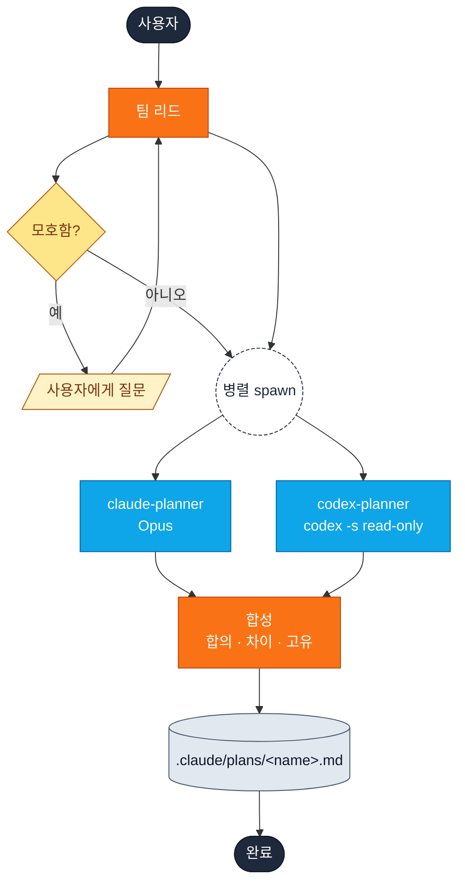
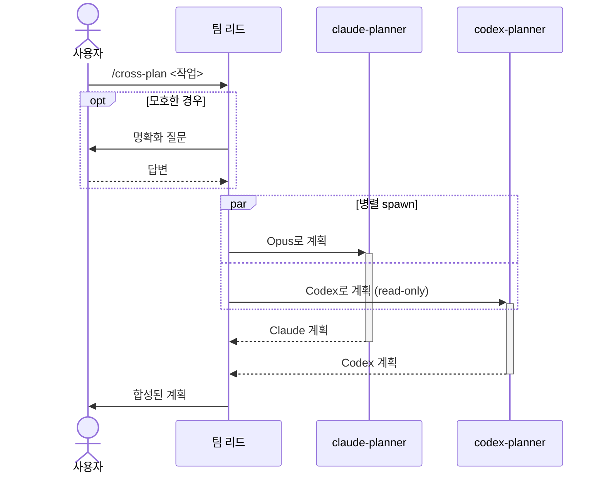

# cross-plan

두 플래너(Claude, Codex)를 **병렬로** 돌린 뒤 Claude Code가 하나의 계획으로 합성합니다.

```
/yumango-plugins:cross-plan <작업 설명>
```

## 어느 skill이 맞나

| `cross-plan` | [`plan-verify`](plan-verify.md) |
| --- | --- |
| 작성자 둘이 병렬 | 작성자 1명 + 비평가 1명 |
| 벽시계 시간이 중요 | 검토자가 전체 계획을 봐야 함 |
| 접근법을 비교하고 싶음 | 명확한 `PASS / NEEDS_REVISION` 필요 |

## 흐름

```text
             사용자
               │
               ▼
            팀 리드 ◄── 명확화 (모호한 경우)
               │
        병렬 spawn (한 메시지, Agent 호출 2개)
        ┌──────┴──────┐
        ▼             ▼
  claude-planner   codex-planner
     (Opus)        (codex exec -s read-only)
        │             │
        └──────┬──────┘
               ▼
              합성
       합의 · 차이 · 고유
               │
               ▼
     .claude/plans/<name>.md
```



```text
1. 사용자         ── /cross-plan ──►  팀 리드
2. 팀 리드        ── spawn ──────►    claude-planner   ┐
   팀 리드        ── spawn ──────►    codex-planner    ┘  병렬
3. claude-planner ── Claude 계획 ──►  팀 리드           ┐
   codex-planner  ── Codex 계획 ───►  팀 리드           ┘  양쪽 대기
4. 팀 리드        (합성)
5. 팀 리드        ── 최종 계획 ──►    사용자
```



## 결과물

| 섹션 | 내용 |
| --- | --- |
| **합의 (Consensus)** | 두 플래너가 동의한 항목 |
| **차이 (Divergence)** | 좌우 비교 + 권고 |
| **고유 인사이트** | 한쪽만 짚은 항목 |
| **최종 통합 계획** | 6-헤딩 형식의 합성 계획 |

`.claude/plans/<name>.md`에 저장됩니다.

## 실패 모드

| claude | codex | 결과 |
| --- | --- | --- |
| ✅ | ✅ | 교차검증 완료 |
| ✅ | ❌ | Claude만 — *미검증* |
| ❌ | ✅ | Codex만 — *미검증* |
| ❌ | ❌ | 재시도 안내 |

## 원본

[`plugin/skills/cross-plan/SKILL.md`](https://github.com/yunmango/yunmango-claude-plugins/blob/main/plugin/skills/cross-plan/SKILL.md)
