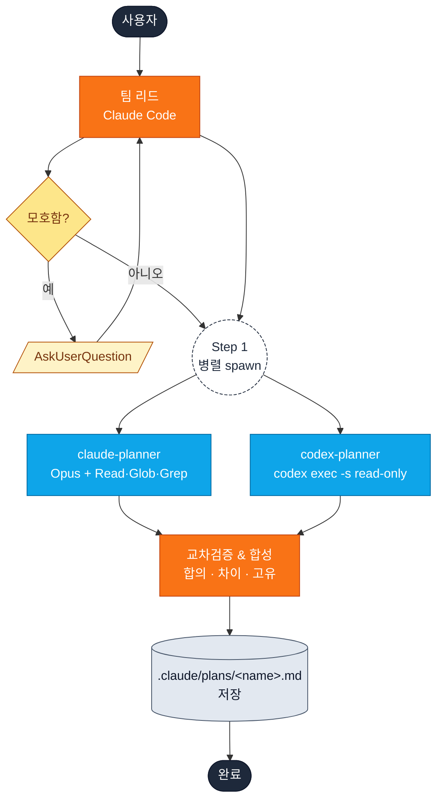
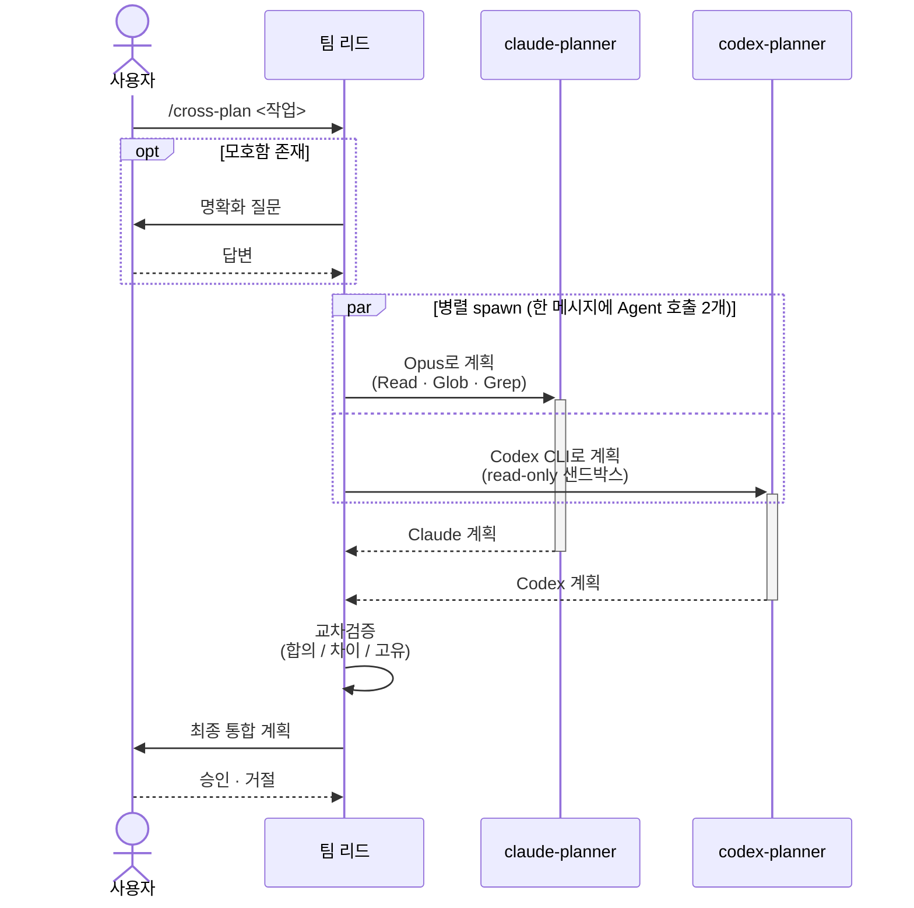

# cross-plan

**병렬 교차검증 계획.** Claude Code가 팀 리드 역할을 맡아 두 개의 독립된 플래너 에이전트를 동시에 실행한 뒤, 그 결과로부터 단일한 검증된 계획을 합성합니다.

## 언제 쓰나

| `cross-plan`을 쓸 때 | 대신 [`plan-verify`](plan-verify.md)가 맞는 경우 |
| --- | --- |
| 같은 작업에 대해 **두 개의 독립된 시각**을 얻고 싶을 때. | **한 명이 작성, 한 명이 비평**하는 순차 흐름이 필요할 때. |
| 벽시계 시간이 중요할 때 — 두 플래너가 병렬 실행. | 검토 모델이 작업이 아닌 **전체 계획**을 보고 검증해야 할 때. |
| 어느 에이전트가 코드베이스를 더 정확히 읽을지 모르겠어 비교가 필요할 때. | 명확한 `PASS / NEEDS_REVISION` verdict이 필요할 때. |

## 빠른 시작

```
/yumango-plugins:cross-plan <작업 설명>
```

또는 의도로 트리거:

> user 모델을 UUID로 마이그레이션하는 계획을 교차검증해줘.

## 한눈에 보는 아키텍처



## 누가 누구와 대화하나



## 단계별 상세

### Step 0 — 명확화 (필요 시만)

팀 리드가 요청에서 모호함, 빠진 제약, 답이 여럿인 설계 결정을 찾습니다. 발견되면 `AskUserQuestion`으로 묻습니다. **이미 명확한 작업이면 이 단계는 건너뜁니다.**

### Step 1 — 두 플래너 병렬 spawn

두 에이전트는 **한 메시지 안에서** `Agent` 도구 호출 두 개로 실행됩니다 — 그래야 동시에 돕니다.

| | claude-planner | codex-planner |
| --- | --- | --- |
| Subagent type | `general-purpose` | `general-purpose` |
| 모델 | `opus` | (Codex CLI 기본값) |
| 도구 | `Read`, `Glob`, `Grep` | `codex exec -s read-only` |
| 입력 | 동일한 계획 프롬프트 + 명확화 답변 | 동일한 계획 프롬프트 + 명확화 답변 |

두 플래너 모두 작성 전에 코드베이스를 읽습니다.

### Step 2 — 양쪽 결과 대기

백그라운드 에이전트들이 계획을 반환합니다. 팀 리드는 두 결과가 모두 도착할 때까지 기다립니다.

### Step 3 — 실패 처리

| claude-planner | codex-planner | 결과 |
| --- | --- | --- |
| ✅ | ✅ | 완전 교차검증 흐름 |
| ✅ | ❌ | Claude 계획만 표시 — *"Single-source plan (unverified)"* 라벨 |
| ❌ | ✅ | Codex 계획만 표시 — *"Single-source plan (unverified)"* 라벨 |
| ❌ | ❌ | 양쪽 오류 보고 후 재시도 안내 |

### Step 4 — 교차검증과 합성

팀 리드가 두 계획을 6-헤딩 템플릿(Goal · Analysis · Architecture · Implementation Steps · Testing Strategy · Edge Cases & Risks)에 따라 섹션별로 비교한 뒤 다음을 만듭니다:

| 섹션 | 목적 |
| --- | --- |
| **합의 (Consensus)** | 두 플래너가 동의한 항목. 신뢰도 최상. |
| **차이 (Divergence)** | 의견이 갈린 항목의 좌우 비교 표 + 팀 리드 권고. |
| **고유 인사이트 (Unique Insights)** | 한쪽만 짚은 가치 있는 지점. 합당하면 반영. |
| **최종 통합 계획** | 동일한 6-헤딩 형식의 합성 계획. |

### Step 5 — 저장

최종 통합 계획은 `.claude/plans/<kebab-case-name>.md`에 저장되며, 다음 푸터가 추가됩니다:

```text
*Cross-verified by Claude Opus + Codex (xhigh reasoning)*
```

### Step 6 — 진행 확인

팀 리드가 구현으로 넘어갈지 묻습니다. 승인하면 plan mode 진입, 거절하면 종료됩니다 (저장된 계획은 언제든 다시 볼 수 있습니다).

## 팁

- **명확화를 건너뛰지 마세요.** 사전에 짧은 답을 주면 사후 수정보다 훨씬 좋은 계획이 나옵니다.
- **차이 표를 꼼꼼히 보세요.** 가장 유용한 인사이트는 합의가 아니라 차이에서 나옵니다.
- **기계적인 작업에는 단일 플래너로 충분합니다.** 답이 하나뿐인 작업이라면 두 플래너는 과합니다 — `plan-verify` (또는 skill 없이)가 더 저렴합니다.

## 원본

프롬프트 템플릿·서브에이전트 설정·폴백 규칙 등 전체 실행 명세는 다음 파일에 있습니다:

- [`plugin/skills/cross-plan/SKILL.md`](https://github.com/yunmango/yunmango-claude-plugins/blob/main/plugin/skills/cross-plan/SKILL.md)
