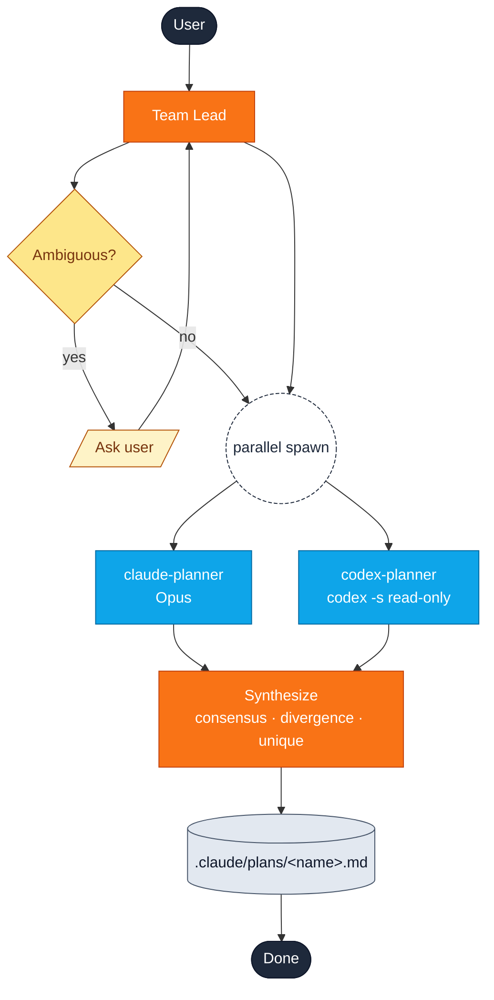
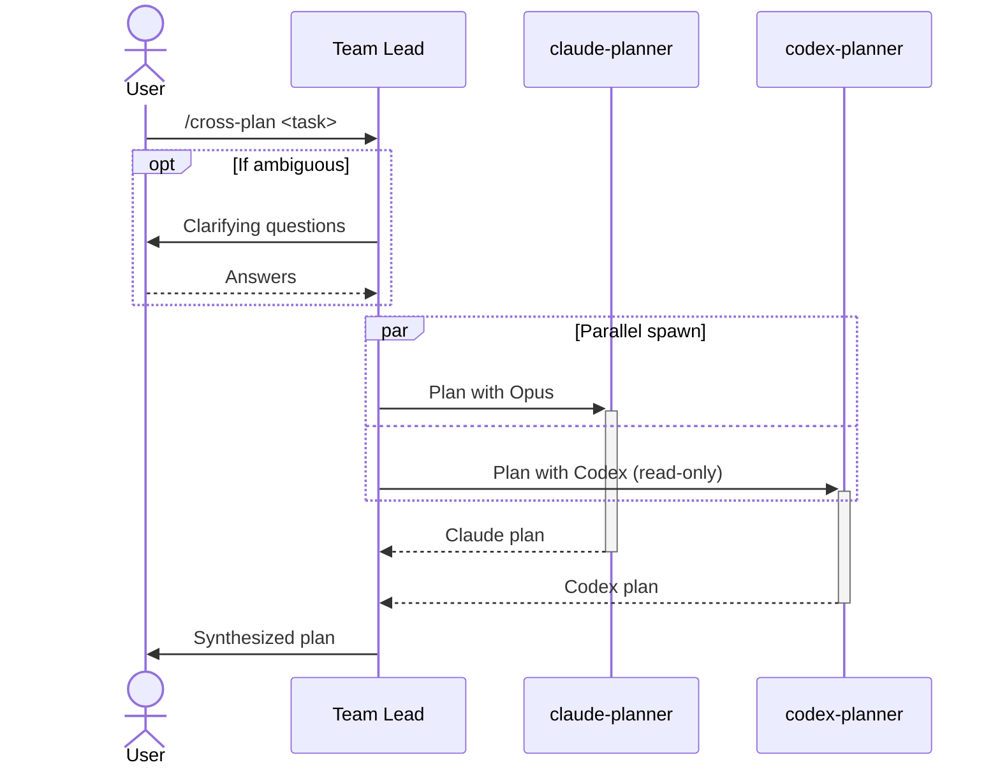

# cross-plan

Two planners run **in parallel** — Claude and Codex — then Claude Code synthesizes a single plan from both.

```
/yumango-plugins:cross-plan <task description>
```

## Pick the right skill

| Use `cross-plan` | Use [`plan-verify`](plan-verify.md) |
| --- | --- |
| Two parallel drafters | One drafter + one critic |
| Wall-clock matters | Reviewer should see the full plan |
| Want to compare approaches | Want a clear `PASS / NEEDS_REVISION` |

## Flow

```text
              User
               │
               ▼
           Team Lead ◄── clarify (if ambiguous)
               │
        parallel spawn (one message, two Agent calls)
        ┌──────┴──────┐
        ▼             ▼
  claude-planner   codex-planner
     (Opus)        (codex exec -s read-only)
        │             │
        └──────┬──────┘
               ▼
           Synthesize
    consensus · divergence · unique
               │
               ▼
     .claude/plans/<name>.md
```



```text
1. User           ── /cross-plan ──►  Team Lead
2. Team Lead      ── spawn ──────►    claude-planner   ┐
   Team Lead      ── spawn ──────►    codex-planner    ┘  parallel
3. claude-planner ── Claude plan ──►  Team Lead         ┐
   codex-planner  ── Codex plan ───►  Team Lead         ┘  await both
4. Team Lead      (synthesize)
5. Team Lead      ── final plan ──►   User
```



## Output

| Section | What it shows |
| --- | --- |
| **Consensus** | Items both planners agreed on |
| **Divergence** | Side-by-side disagreements + recommendation |
| **Unique Insights** | Points raised by only one planner |
| **Final Integrated Plan** | 6-heading synthesized plan |

Saved to `.claude/plans/<name>.md`.

## Failure modes

| claude | codex | Result |
| --- | --- | --- |
| ✅ | ✅ | Cross-verified |
| ✅ | ❌ | Claude only — *unverified* |
| ❌ | ✅ | Codex only — *unverified* |
| ❌ | ❌ | Retry suggested |

## Source

[`plugin/skills/cross-plan/SKILL.md`](https://github.com/yunmango/yunmango-claude-plugins/blob/main/plugin/skills/cross-plan/SKILL.md)
