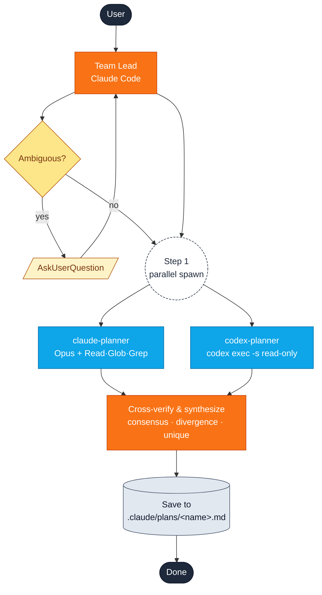
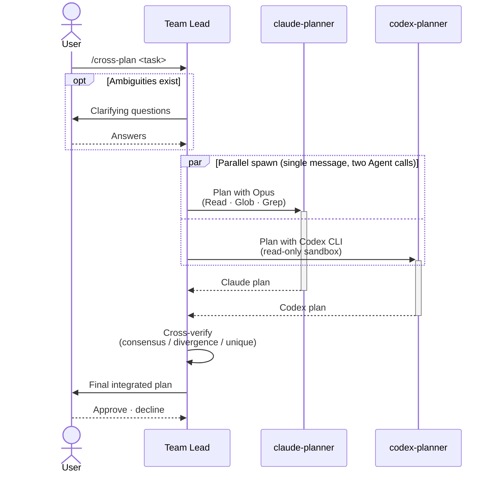

# cross-plan

**Parallel cross-verified planning.** Claude Code acts as a team lead, spawns two independent planner agents at the same time, and synthesizes a single verified plan from their outputs.

## When to use it

| Use `cross-plan` when… | Use [`plan-verify`](plan-verify.md) instead when… |
| --- | --- |
| You want **two independent perspectives** on the same task. | You want **one drafter + one critic** in sequence. |
| Wall-clock matters — both planners run in parallel. | The reviewer should see the full plan, not just the task. |
| You're not sure which agent will read the codebase more accurately, and want to compare. | You want a clear `PASS / NEEDS_REVISION` verdict. |

## Quick start

```
/yumango-plugins:cross-plan <task description>
```

Or trigger by intent:

> Cross-verify a plan for migrating the user model to UUIDs.

## Architecture at a glance



## Who talks to whom



## Step-by-step

### Step 0 — Clarify (only if needed)

The team lead scans the request for ambiguity, missing constraints, or design decisions with multiple valid answers. If found, it asks via `AskUserQuestion`. **If the task is already clear, this step is skipped.**

### Step 1 — Spawn both planners in parallel

Both agents are launched in a **single message** with two `Agent` tool calls — that's what makes them run concurrently.

| | claude-planner | codex-planner |
| --- | --- | --- |
| Subagent type | `general-purpose` | `general-purpose` |
| Model | `opus` | (Codex CLI default) |
| Tools | `Read`, `Glob`, `Grep` | `codex exec -s read-only` |
| Receives | Same planning prompt + clarifications | Same planning prompt + clarifications |

Both planners read your codebase before writing anything.

### Step 2 — Wait for both

Backgrounded agents return their plans. The team lead waits for both before proceeding.

### Step 3 — Handle failures

| claude-planner | codex-planner | What you see |
| --- | --- | --- |
| ✅ | ✅ | Full cross-verification |
| ✅ | ❌ | Claude's plan only — labeled *"Single-source plan (unverified)"* |
| ❌ | ✅ | Codex's plan only — labeled *"Single-source plan (unverified)"* |
| ❌ | ❌ | Both errors reported, retry suggested |

### Step 4 — Cross-verify and synthesize

The team lead compares both plans section-by-section against the 6-heading template (Goal · Analysis · Architecture · Implementation Steps · Testing Strategy · Edge Cases & Risks) and produces:

| Section | Purpose |
| --- | --- |
| **Consensus** | Items both planners agreed on. Highest reliability. |
| **Divergence** | Side-by-side table of disagreements + the team lead's recommendation. |
| **Unique Insights** | Valuable points raised by only one planner. Kept if valid. |
| **Final Integrated Plan** | The synthesized plan in the same 6-heading format. |

### Step 5 — Save

The Final Integrated Plan is written to `.claude/plans/<kebab-case-name>.md` with this footer:

```text
*Cross-verified by Claude Opus + Codex (xhigh reasoning)*
```

### Step 6 — Confirm

The team lead asks whether to proceed with implementation. Approve to enter plan mode; decline to stop here (you can revisit the saved plan anytime).

## Tips

- **Don't skip clarifications.** Answering a few short questions upfront produces a far better plan than retroactive fixes.
- **Read the divergence table carefully.** The most useful insight is often there, not in the consensus.
- **For mechanical tasks, use a single planner.** If the task has only one obvious approach, two planners is overkill — `plan-verify` (or no skill) is cheaper.

## Source

The full executable specification — prompt templates, subagent configuration, fallback rules — lives in:

- [`plugin/skills/cross-plan/SKILL.md`](https://github.com/yunmango/yunmango-claude-plugins/blob/main/plugin/skills/cross-plan/SKILL.md)
