# deep-interview

모호한 요청을 계획 수립 **이전에** Socratic 질문으로 명세화합니다.

```
/yumango-plugins:deep-interview <대략적 요청>
```

## 언제 쓰나

| `deep-interview` | [`cross-plan`](cross-plan.md) / [`plan-verify`](plan-verify.md) |
| --- | --- |
| Goal / scope / done criteria가 모호 | 요구사항이 이미 명확 |
| 무엇을 만들지 모름 | 무엇을 만들지 알고 있음 |
| 숨은 가정을 드러내야 함 | 계획 작성 준비 완료 |

`deep-interview`는 **상위(upstream)** 단계입니다. 명세를 만든 뒤 `cross-plan` 또는 `plan-verify`에 넘겨 실제 계획을 작성합니다.

## 흐름

```text
             사용자
               │
               ▼
   /yumango-plugins:deep-interview <대략적 요청>
               │
               ▼
   가장 모호한 축 선택 (Goal → Scope → Constraints → Done → Context)
               │
       ┌───────┴───────┐
       ▼               ▼
  코드베이스 사실    사용자 판단
   (description)    (prescription)
       │               │
       └───────┬───────┘
               ▼
        이해도 갱신
               │
   3–4 질문마다: breadth check (빈 축 있나?)
               │
               ▼
        5축 stop check
               │
   (assumption)-only 축 있음? ── 예 → 1개 더 질문
               │
               아니오
               ▼
          Final Output
   Goal · In-scope · Out-of-scope · Constraints
   · Done criteria · Assumptions · Open questions
               │
               ▼
    cross-plan / plan-verify로 인계
```



```mermaid
flowchart TD
    User([사용자]):::actor --> Slash[/deep-interview &lt;요청&gt;/]:::io
    Slash --> Pick[가장 모호한 축 선택<br/>Goal → Scope → Constraints → Done → Context]:::lead
    Pick --> Q{코드베이스로 답 가능?}:::decision
    Q -- 예 --> Code[코드 읽기<br/>사실 = description]:::agent
    Q -- 아니오 --> Ask[/사용자에게 질문/]:::io
    Code --> Update[이해도 갱신]:::lead
    Ask --> Update
    Update --> Breadth{3–4 질문마다:<br/>빈 축 있나?}:::decision
    Breadth -- 예 --> Pick
    Breadth -- 아니오 --> Stop{5축 모두<br/>사용자 답변 있음?}:::decision
    Stop -- "&#40;assumption&#41;-only" --> Ask
    Stop -- 예 --> Final[(Final Output 명세)]:::store
    Final --> Handoff([cross-plan / plan-verify로 인계]):::actor

    classDef actor fill:#1e293b,color:#fff,stroke:#0f172a;
    classDef lead fill:#f97316,color:#fff,stroke:#c2410c;
    classDef agent fill:#0ea5e9,color:#fff,stroke:#0369a1;
    classDef decision fill:#fde68a,color:#78350f,stroke:#b45309;
    classDef io fill:#fef3c7,color:#78350f,stroke:#b45309;
    classDef store fill:#e2e8f0,color:#0f172a,stroke:#475569;
```

## 질문 축

우선순위 순서로, 가장 모호한 축 *하나*를 선택:

| 축 | 결정하는 것 |
| --- | --- |
| **Goal** | 추구하는 결과 |
| **Scope** | 범위 / 제외 범위 |
| **Constraints** | 지켜야 할 제약 |
| **Done criteria** | "끝났다"의 기준 |
| **Existing context** | 기존에 있는 것; blast radius |

각 질문은 고정 포맷을 따릅니다:

```md
Current understanding: {한 문장 요약}
Stuck decision: {가장 중요한 불확실성}
Recommended answer: {있다면}
Question: {질문 하나}
```

## 가정 방지 가드

| 가드 | 효과 |
| --- | --- |
| **Description vs Prescription** | 코드베이스 사실(*"프로젝트가 JWT 사용"*)은 description일 뿐, 사용자 확인 없이 prescription(*"새 기능도 JWT를 써야 함"*)으로 자동 확장 금지 |
| **Assumption marker** | LLM이 추론한 항목은 `(assumption)`으로 태깅 — 결정으로 굳어지지 않게 |
| **Breadth check** | 3–4 질문마다 5축 스캔 — 빈 축이 있으면 그쪽 우선, 한 축만 깊이 파지 않음 |
| **Stop check** | 어느 축이 `(assumption)`만으로 채워져 있으면, 종료 전 직접 질문 1개 추가 |

## Final Output

인터뷰는 고정 템플릿으로 마무리됩니다 — 전체 대화 내용은 버려집니다:

```md
## Goal
...

## In-scope
- ...

## Out-of-scope
- ...

## Constraints
- ...

## Done criteria
- ...

## Assumptions
- {사용자가 명시적으로 확인하지 않은 항목 — 계획 단계에서 검증 필요}

## Open questions
- {여전히 미결인 항목}
```

**사용자 확정 의도**와 **가정**이 명확히 분리되는 것이 핵심 — 다음 단계(`cross-plan` / `plan-verify`)가 무엇을 검증해야 할지 정확히 알 수 있게 됩니다.

## 호출

`disable-model-invocation: true` — 명시적 `/yumango-plugins:deep-interview` 슬래시 명령으로만 트리거됩니다. 자연어로는 모델이 자동 호출하지 않습니다.

## 원본

[`plugin/skills/deep-interview/SKILL.md`](https://github.com/yunmango/yunmango-claude-plugins/blob/main/plugin/skills/deep-interview/SKILL.md)
