# deep-interview

Crystallize an ambiguous request into a clear specification through Socratic questioning — **before** any planning step.

```
/yunmango-plugins:deep-interview <rough request>
```

## When to use

| Use `deep-interview` | Use [`cross-plan`](cross-plan.md) / [`plan-verify`](plan-verify.md) |
| --- | --- |
| Goal / scope / done criteria are vague | Requirements are already clear |
| You are unsure what to build | You know what to build |
| Need to surface hidden assumptions | Ready to write the plan |

`deep-interview` is the **upstream** step. Hand the resulting spec to `cross-plan` or `plan-verify` for actual planning.

## Flow

```text
              User
               │
               ▼
   /yunmango-plugins:deep-interview <rough request>
               │
               ▼
   pick most unclear axis (Goal → Scope → Constraints → Done → Context)
               │
       ┌───────┴───────┐
       ▼               ▼
 codebase fact     user judgment
 (description)     (prescription)
       │               │
       └───────┬───────┘
               ▼
       update understanding
               │
   every 3–4 Q: breadth check (any empty axis?)
               │
               ▼
       stop check across 5 axes
               │
   (assumption)-only axis? ── yes → ask 1 more
               │
               no
               ▼
           Final Output
   Goal · In-scope · Out-of-scope · Constraints
   · Done criteria · Assumptions · Open questions
               │
               ▼
     hand off to cross-plan / plan-verify
```



```mermaid
flowchart TD
    User([User]):::actor --> Slash[/deep-interview &lt;request&gt;/]:::io
    Slash --> Pick[Pick most unclear axis<br/>Goal → Scope → Constraints → Done → Context]:::lead
    Pick --> Q{Codebase-answerable?}:::decision
    Q -- yes --> Code[Read codebase<br/>fact = description]:::agent
    Q -- no --> Ask[/Ask user/]:::io
    Code --> Update[Update understanding]:::lead
    Ask --> Update
    Update --> Breadth{Every 3–4 Q:<br/>any empty axis?}:::decision
    Breadth -- yes --> Pick
    Breadth -- no --> Stop{All 5 axes have<br/>direct user input?}:::decision
    Stop -- "&#40;assumption&#41;-only" --> Ask
    Stop -- yes --> Final[(Final Output spec)]:::store
    Final --> Handoff([Hand off to cross-plan / plan-verify]):::actor

    classDef actor fill:#1e293b,color:#fff,stroke:#0f172a;
    classDef lead fill:#f97316,color:#fff,stroke:#c2410c;
    classDef agent fill:#0ea5e9,color:#fff,stroke:#0369a1;
    classDef decision fill:#fde68a,color:#78350f,stroke:#b45309;
    classDef io fill:#fef3c7,color:#78350f,stroke:#b45309;
    classDef store fill:#e2e8f0,color:#0f172a,stroke:#475569;
```

## Question axes

Pick the single most unclear axis, in priority order:

| Axis | What it pins down |
| --- | --- |
| **Goal** | The outcome being pursued |
| **Scope** | What's in / out of scope |
| **Constraints** | What must be honored |
| **Done criteria** | When the work is "done" |
| **Existing context** | What already exists; blast radius |

Each question carries a fixed format:

```md
Current understanding: {one-sentence summary}
Stuck decision: {the most important uncertainty}
Recommended answer: {if any}
Question: {a single question}
```

## Anti-assumption guards

| Guard | Effect |
| --- | --- |
| **Description vs Prescription** | A codebase fact (*"project uses JWT"*) is description, never auto-extends into a prescription (*"new feature should also use JWT"*) without user confirmation. |
| **Assumption marker** | LLM-inferred items are tagged `(assumption)` so they cannot silently harden into decisions. |
| **Breadth check** | Every 3–4 questions, scan all 5 axes; pick the next question from an empty axis rather than drilling deeper. |
| **Stop check** | If any axis is `(assumption)`-only, ask one more direct question before stopping. |

## Final Output

The interview ends with a fixed template — the full transcript is dropped:

```md
## Goal
...

## In-scope
- ...

## Out-of-scope
- ...

## Constraints
- ...

## Done criteria
- ...

## Assumptions
- {items the user did not explicitly confirm — flag for the planning step to verify}

## Open questions
- {anything still unresolved}
```

The clear separation of **user-confirmed intent** vs **assumptions** is what the planning step (`cross-plan` / `plan-verify`) consumes — it knows exactly what still needs verification.

## Invocation

`disable-model-invocation: true` — only the explicit `/yunmango-plugins:deep-interview` slash command triggers this skill. The model will not auto-invoke it from natural language.

## Source

[`plugin/skills/deep-interview/SKILL.md`](https://github.com/yunmango/yunmango-claude-plugins/blob/main/plugin/skills/deep-interview/SKILL.md)
