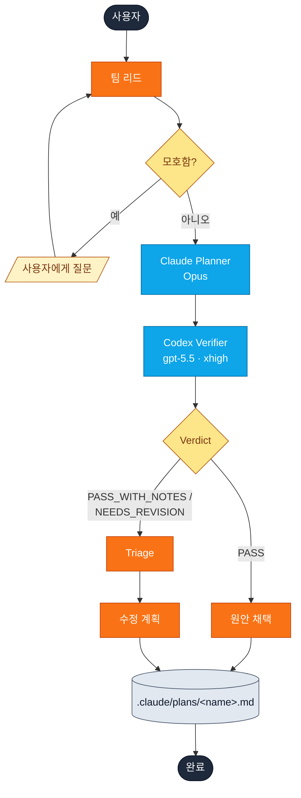
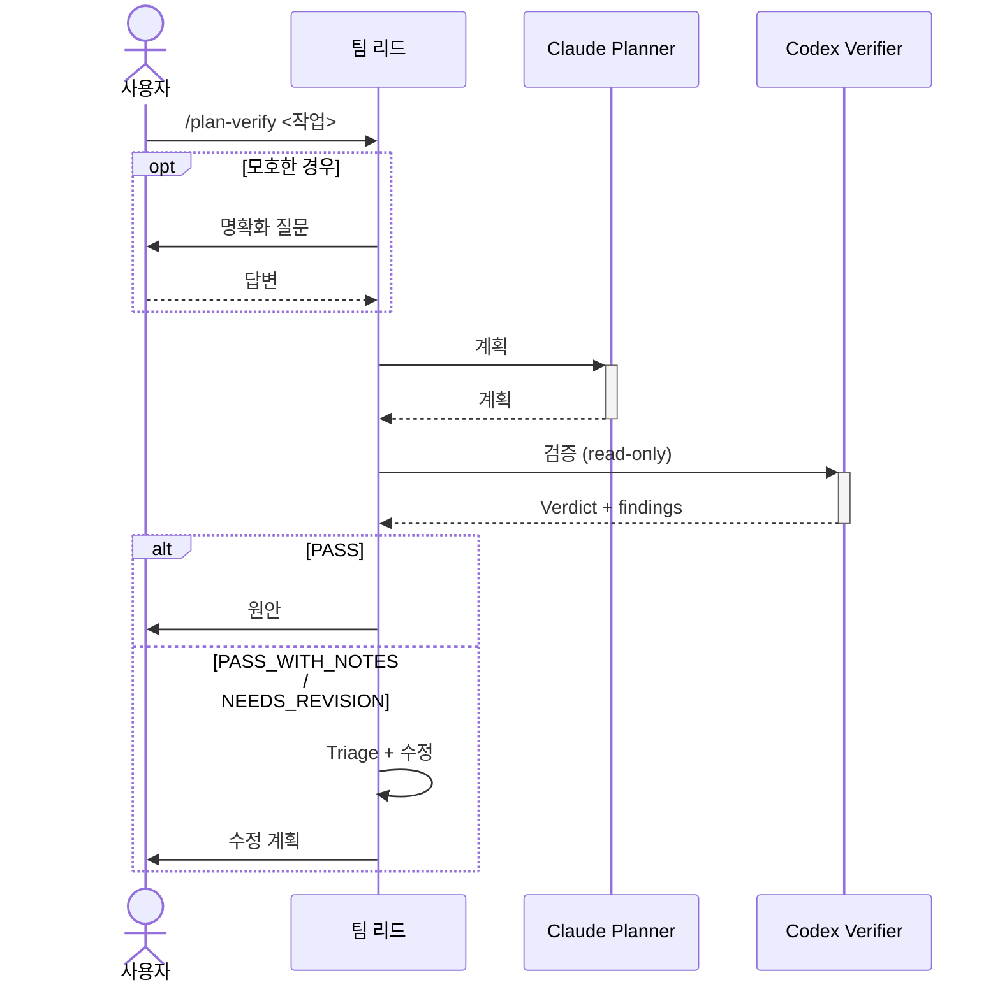

# plan-verify

Claude Opus가 계획을 작성하고, Codex(xhigh)가 코드베이스 대비 검증해 verdict을 반환합니다.

```
/yumango-plugins:plan-verify <작업 설명>
```

## 어느 skill이 맞나

| `plan-verify` | [`cross-plan`](cross-plan.md) |
| --- | --- |
| 작성자 1명 + 비평가 1명 | 작성자 둘이 병렬 |
| 검토자가 전체 계획을 봐야 함 | 벽시계 시간이 중요 |
| `PASS / NEEDS_REVISION` verdict 필요 | 좌우 비교가 필요 |

## 흐름





## Verdict별 처리

| Verdict | 결과 |
| --- | --- |
| **PASS** | 원안 그대로 채택 |
| **PASS_WITH_NOTES** | Triage → 경미한 수정 |
| **NEEDS_REVISION** | Triage → 수정 + 변경 목록 |

## Triage 규칙

Codex의 각 finding을 분류:

| 분류 | 사용 시점 |
| --- | --- |
| **ACCEPT** | 코드베이스 사실 정정 (기본값) |
| **ACCEPT_WITH_MODIFICATION** | 우려는 타당, 완화책은 가볍게 |
| **REJECT** | 경험적으로 틀림 / 범위 밖 / 추측 / 순수 스타일 — 한 줄 사유 필수 |

확신이 없으면 팀 리드가 분류 전에 참조 파일을 직접 읽습니다.

## 원본

[`plugin/skills/plan-verify/SKILL.md`](https://github.com/yunmango/yunmango-claude-plugins/blob/main/plugin/skills/plan-verify/SKILL.md)
