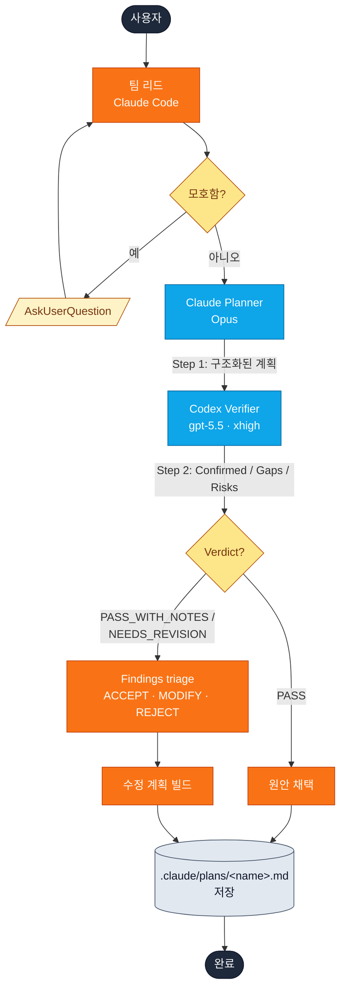
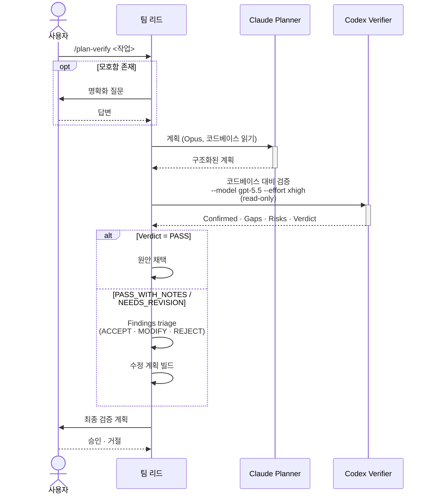
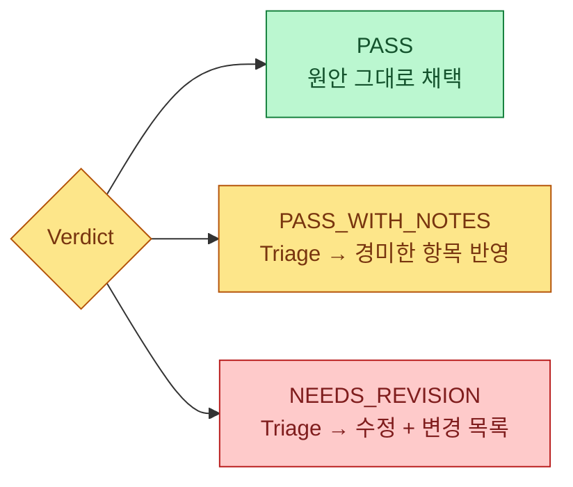

# plan-verify

**순차 계획-검증 워크플로.** Claude Opus가 구현 계획 초안을 작성한 뒤, Codex(xhigh reasoning)가 실제 코드베이스에 비추어 그 계획을 독립적으로 검증하고 verdict을 반환합니다.

## 언제 쓰나

| `plan-verify`를 쓸 때 | 대신 [`cross-plan`](cross-plan.md)이 맞는 경우 |
| --- | --- |
| **한 명이 작성, 한 명이 비평**하는 순차 흐름이 필요할 때. | **두 작성자를 병렬로** 비교하고 싶을 때. |
| 검토 모델이 작업이 아닌 **전체 계획**을 보고 검증해야 할 때. | 벽시계 시간이 중요해 두 플래너 동시 실행이 필요할 때. |
| 구현 시작 전에 명확한 `PASS / NEEDS_REVISION` verdict이 필요할 때. | 갈라지는 접근법을 좌우 비교로 드러내고 싶을 때. |

## 빠른 시작

```
/yumango-plugins:plan-verify <작업 설명>
```

또는 의도로 트리거:

> auth 미들웨어 리팩토링 계획 세우고 Codex가 검증하게 해줘.

> 계획 좀 단단하게 세워줘

## 한눈에 보는 아키텍처



## 누가 누구와 대화하나



## 단계별 상세

### Step 0 — 명확화 (필요 시만)

팀 리드가 모호함, 빠진 제약, 답이 여럿인 설계 결정을 점검합니다. 발견되면 `AskUserQuestion`으로 묻습니다. **이미 명확한 작업이면 건너뜁니다.**

### Step 1 — Claude Planner (foreground)

`Agent` 호출 1개:

- Subagent type: `general-purpose`
- 모델: `opus`
- 도구: `Read`, `Glob`, `Grep` (외부 CLI 미사용)
- 출력: 6-헤딩 계획 (Goal · Analysis · Architecture · Implementation Steps · Testing Strategy · Edge Cases & Risks)

전체 계획이 다음 단계의 입력이 됩니다.

### Step 2 — Codex Verifier (foreground)

`codex:codex-rescue`를 향한 `Agent` 호출 1개. 프롬프트는 반드시 다음으로 **시작**합니다:

```
--model gpt-5.5 --effort xhigh

This is a read-only review task. Do not modify any files.
```

…뒤에 원본 작업과 Claude Planner의 전체 계획이 담긴 검증 프롬프트가 붙습니다. Codex가 코드베이스를 다시 탐색한 뒤 다음을 반환합니다:

| 섹션 | 내용 |
| --- | --- |
| **Confirmed** | 실제 코드에 근거를 둔 계획 항목. |
| **Gaps** | 빠진 파일·의존성·고려사항. |
| **Risks** | 잠재 이슈와 완화책. |
| **Ordering Issues** | 아직 만들어지지 않은 무언가에 의존하는 단계. |
| **Verdict** | `PASS`, `PASS_WITH_NOTES`, `NEEDS_REVISION` 중 하나. |

### Step 3 — 최종 계획 합성

verdict에 따라 팀 리드의 처리 방식이 달라집니다:



#### Step 3a — Triage (PASS면 건너뜀)

각 finding을 다음으로 분류:

| 분류 | 사용 시점 |
| --- | --- |
| **ACCEPT** | 코드베이스 사실 정정 (파일 경로, 함수 시그니처, 순서 오류). 기본값. |
| **ACCEPT_WITH_MODIFICATION** | 우려는 타당하나 제안된 완화책이 과한 경우 — 표현 다듬기, 범위 좁히기, 단계 분할. |
| **REJECT** | 발견이 경험적으로 틀렸거나, 범위 밖이거나, 추측적이거나, 순수 스타일 문제일 때만 허용. **각 REJECT는 한 줄짜리 사유를 동반.** |

확신이 안 서면 팀 리드가 분류 전에 **참조된 파일을 직접 읽습니다** — 영향이 큰 항목(아키텍처 변경, regex 정확성, 순서 이슈, 의존성 누락)에는 trust-but-verify가 기본입니다.

#### Step 3b — 수정 계획 빌드

ACCEPT와 ACCEPT_WITH_MODIFICATION 항목이 6-헤딩 계획에 병합됩니다. REJECT 항목은 별도로 표시되어 사용자가 의도적으로 어떤 항목이 빠졌는지 보고 이유를 확인할 수 있습니다.

`NEEDS_REVISION`인 경우, 변경된 부분을 알 수 있도록 짧은 변경 목록이 함께 첨부됩니다.

### Step 4 — 저장 및 확인

계획은 다음 푸터와 함께 `.claude/plans/<kebab-case-name>.md`에 저장됩니다:

```text
*Planned by Claude Opus · Verified by Codex (xhigh reasoning)*
```

팀 리드가 진행 여부를 묻습니다. 승인 → plan mode 진입. 거절 → 종료.

## 출력 구조

```text
## Verification Summary

**Verdict**: <PASS | PASS_WITH_NOTES | NEEDS_REVISION>

### Codex Verification Highlights
- Confirmed: ...
- Gaps: ...
- Risks: ...

### Findings Triage  (Verdict이 PASS면 생략)
- ACCEPT: ...
- ACCEPT_WITH_MODIFICATION: ...
- REJECT: ...   (각 항목에 사유 첨부)

### Final Verified Plan
<6-heading 계획>
```

## 팁

- **`PASS_WITH_NOTES`가 가장 흔한 verdict입니다.** 비자명한 작업에서 깨끗한 `PASS`는 드뭅니다. 노트는 저렴한 보험으로 다루세요.
- **순서 이슈를 주의 깊게 보세요.** Codex는 "단계 N이 단계 N+2까지 만들어지지 않는 무언가에 의존함" 같은 패턴을 찾는 데 특히 강합니다. 거의 항상 수용 가치가 있습니다.
- **`REJECT`는 드물어야 합니다.** 발견 항목 대부분을 reject하고 있다면, 플래너 초안이 코드베이스와 동떨어져 있을 가능성이 큽니다 — 더 구체적인 작업 설명으로 다시 실행하세요.

## 원본

플래너·검증자 프롬프트 템플릿, 모델/effort 플래그, 샌드박스 요구사항 등 전체 실행 명세는 다음 파일에 있습니다:

- [`plugin/skills/plan-verify/SKILL.md`](https://github.com/yunmango/yunmango-claude-plugins/blob/main/plugin/skills/plan-verify/SKILL.md)
