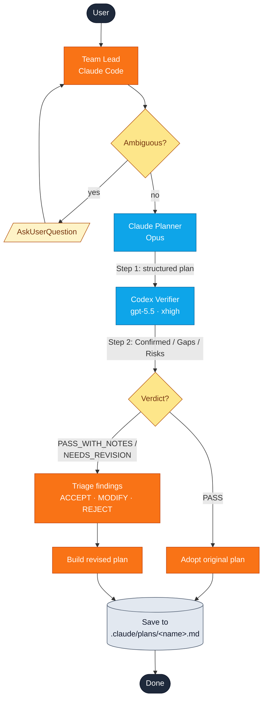
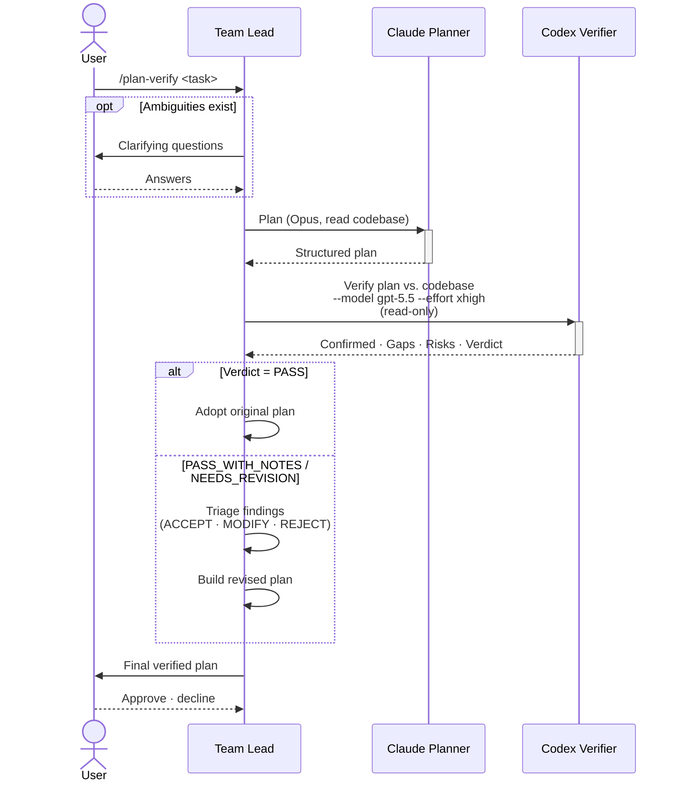
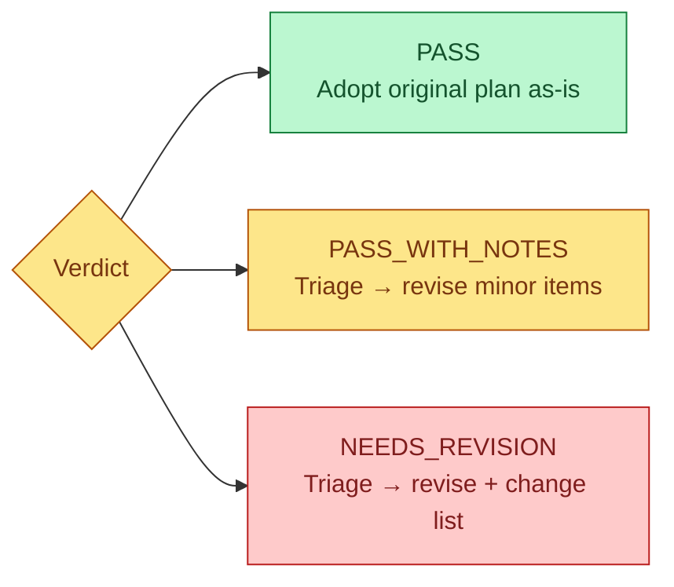

# plan-verify

**Sequential plan-then-verify workflow.** Claude Opus drafts an implementation plan, then Codex (xhigh reasoning) independently verifies it against the actual codebase and returns a verdict.

## When to use it

| Use `plan-verify` when… | Use [`cross-plan`](cross-plan.md) instead when… |
| --- | --- |
| You want **one drafter + one critic** in sequence. | You want **two parallel drafters** to compare. |
| The reviewer should see the **full plan**, not just the task. | Wall-clock matters and you can run two planners at once. |
| You want a clear `PASS / NEEDS_REVISION` verdict before implementing. | You want to surface divergent approaches side-by-side. |

## Quick start

```
/yumango-plugins:plan-verify <task description>
```

Or trigger by intent:

> Plan the auth middleware refactor and have Codex verify it.

> 계획 좀 단단하게 세워줘

## Architecture at a glance



## Who talks to whom



## Step-by-step

### Step 0 — Clarify (only if needed)

The team lead checks for ambiguity, missing constraints, or design choices with multiple valid answers. Asks via `AskUserQuestion` if found. **Skipped if the task is already clear.**

### Step 1 — Claude Planner (foreground)

A single `Agent` call with:

- Subagent type: `general-purpose`
- Model: `opus`
- Tools: `Read`, `Glob`, `Grep` (no external CLI)
- Output: 6-heading plan (Goal · Analysis · Architecture · Implementation Steps · Testing Strategy · Edge Cases & Risks)

The full plan becomes input to the next step.

### Step 2 — Codex Verifier (foreground)

A single `Agent` call to `codex:codex-rescue` with the prompt **starting** as:

```
--model gpt-5.5 --effort xhigh

This is a read-only review task. Do not modify any files.
```

…followed by the verification prompt template containing the original task and the Claude Planner's full plan. Codex re-explores the codebase and returns:

| Section | What it contains |
| --- | --- |
| **Confirmed** | Plan items grounded in real code. |
| **Gaps** | Missing files, dependencies, or considerations. |
| **Risks** | Potential issues with mitigations. |
| **Ordering Issues** | Steps that depend on something not yet created. |
| **Verdict** | One of `PASS`, `PASS_WITH_NOTES`, `NEEDS_REVISION`. |

### Step 3 — Synthesize the final plan

How the team lead handles the verifier output depends on the verdict:



#### Step 3a — Triage (skipped on PASS)

Each finding is classified:

| Disposition | When to use |
| --- | --- |
| **ACCEPT** | Codebase-grounded factual corrections (file paths, function signatures, ordering errors). Default. |
| **ACCEPT_WITH_MODIFICATION** | Concern is valid but the suggested fix is heavier than needed — rephrase, narrow, or split. |
| **REJECT** | Only allowed if the finding is empirically wrong, out of scope, speculative, or pure stylistic preference. **Each REJECT carries a one-line justification.** |

When unsure, the team lead **reads the referenced file** before classifying — trust-but-verify is the default for high-impact items (architecture changes, regex correctness, ordering issues, missing dependencies).

#### Step 3b — Build the revised plan

ACCEPT and ACCEPT_WITH_MODIFICATION items are merged into the 6-heading plan. REJECT items are surfaced separately so you can see what was deliberately skipped and why.

For `NEEDS_REVISION`, a brief change list is attached so you can see what moved.

### Step 4 — Save and confirm

The plan is written to `.claude/plans/<kebab-case-name>.md` with:

```text
*Planned by Claude Opus · Verified by Codex (xhigh reasoning)*
```

The team lead asks whether to proceed. Approve → enter plan mode. Decline → stop here.

## Output structure

```text
## Verification Summary

**Verdict**: <PASS | PASS_WITH_NOTES | NEEDS_REVISION>

### Codex Verification Highlights
- Confirmed: ...
- Gaps: ...
- Risks: ...

### Findings Triage  (omitted when Verdict is PASS)
- ACCEPT: ...
- ACCEPT_WITH_MODIFICATION: ...
- REJECT: ...   (each with justification)

### Final Verified Plan
<6-heading plan>
```

## Tips

- **`PASS_WITH_NOTES` is the most common verdict.** A clean `PASS` on a non-trivial task is rare. Treat the notes as cheap insurance.
- **Watch for ordering issues.** Codex is unusually good at flagging "step N depends on something not created until step N+2." Almost always worth accepting.
- **`REJECT` should be rare.** If you find yourself rejecting most findings, the planner's draft is probably out of touch with the codebase — re-run with a more specific task description.

## Source

The full executable specification — planner and verifier prompt templates, model/effort flags, sandbox requirements — lives in:

- [`plugin/skills/plan-verify/SKILL.md`](https://github.com/yunmango/yunmango-claude-plugins/blob/main/plugin/skills/plan-verify/SKILL.md)
