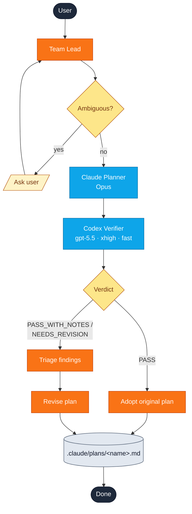
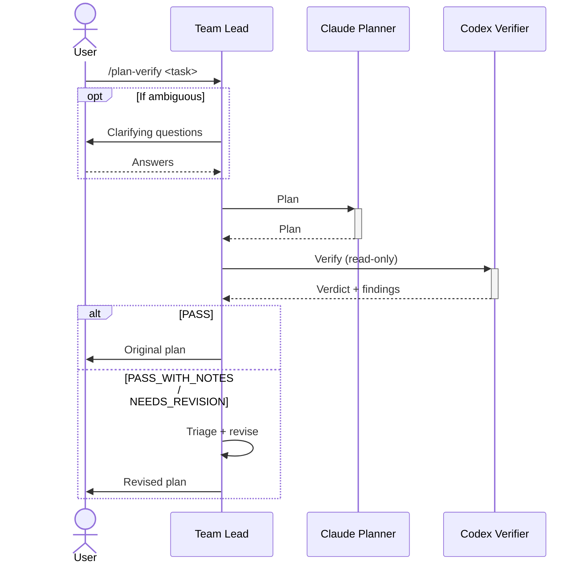

# plan-verify

Claude Opus drafts a plan, then Codex (gpt-5.5, xhigh reasoning, fast mode) verifies it against the codebase and returns a verdict.

```
/yumango-plugins:plan-verify <task description>
```

## Pick the right skill

| Use `plan-verify` | Use [`cross-plan`](cross-plan.md) |
| --- | --- |
| One drafter + one critic | Two parallel drafters |
| Reviewer needs the full plan | Wall-clock matters |
| Want a `PASS / NEEDS_REVISION` verdict | Want side-by-side approaches |

## Flow

```text
              User
               │
               ▼
           Team Lead ◄── clarify (if ambiguous)
               │
               ▼
       Claude Planner (Opus)
               │
               ▼
       Codex Verifier (gpt-5.5 · xhigh · fast, read-only)
               │
        ┌──────┴──────┐
        ▼             ▼
      PASS    PASS_WITH_NOTES /
        │     NEEDS_REVISION
        │             │
        │             ▼
        │      Triage + revise
        │             │
        └──────┬──────┘
               ▼
     .claude/plans/<name>.md
```



```text
1. User           ── /plan-verify ──►  Team Lead
2. Team Lead      ── plan ──────►      Claude Planner
3. Claude Planner ── plan ──────►      Team Lead
4. Team Lead      ── verify ────►      Codex Verifier   (read-only)
5. Codex Verifier ── verdict + findings ──►  Team Lead
6. Team Lead      (triage + revise, if not PASS)
7. Team Lead      ── final plan ──►    User
```



## Verdict routing

| Verdict | Result |
| --- | --- |
| **PASS** | Original plan adopted as-is |
| **PASS_WITH_NOTES** | Triage findings → minor revisions |
| **NEEDS_REVISION** | Triage findings → revise + change list |

## Triage rules

Each Codex finding is classified:

| Disposition | When |
| --- | --- |
| **ACCEPT** | Codebase-grounded factual corrections (default) |
| **ACCEPT_WITH_MODIFICATION** | Valid concern, lighter mitigation |
| **REJECT** | Empirically wrong, out of scope, speculative, or pure style — requires one-line justification |

When uncertain, the team lead reads the referenced file before classifying.

## Source

[`plugin/skills/plan-verify/SKILL.md`](https://github.com/yunmango/yunmango-claude-plugins/blob/main/plugin/skills/plan-verify/SKILL.md)
